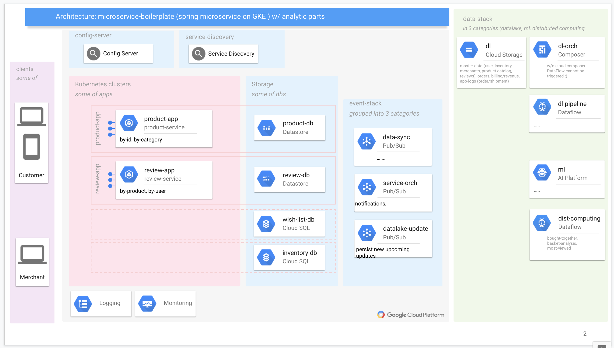

# core-service-h2

to create microservices faster, you need a backbone. This boilerplate prepared to practise core microservice concepts like: 

- [x] cloud-native (stateless on K8s)
- [ ] cloud-native (state-full on GCP PaaS)
- [x] REST maturity: L2 and L3 (HATEOS)
- [x] naming conventions
- [x] actuator
- [x] logging: general
- [ ] logging: transaction-tracing
- [x] error-handling: general
- [ ] error-handling: fault-tolerant
- [ ] security
- [ ] profiles (dev, test, prod)
- [ ] logical boundaries
- [ ] config-server
- [ ] service-discovery
- [ ] event-sourcing
- [ ] CQRS (separate read and write queries)

### Technology stack

- Requirements (openjdk 1.8, docker, GKE)
- spring boot 2.2.6, gradle 6.3, Lombok 1.18

## Naming Conventions

- project name for template
    - intellij top-level: core-service-h2
    - package name: com.backbone.core

- project name for a real service will take place below!
    - intellij top-level: product-service
    - package name: com.backbone.core
    - gradle's project name: product-service
        - jar name: build/libs/product-service-0.0.1-SNAPSHOT.jar
    - deployment name in k8s: product-service

## How To Start

**on IDE**, 

1. `mkdir microservice-backbone-boilerplate && cd microservice-backbone-boilerplate` then
    - `git clone https://github.com/tansudasli/core-service-h2.git && cd core-service-h2`
2. to Run the application  
   * `./gradlew bootRun` to start,
   * `./gradlew bootJar` to create jar lib, and run w/ `java -jar build/libs/*.jar`
3. to test run `curl localhost:8080`
   * `curl localhost:8080/dummy` or `curl localhost:8080/dummy/name`
   * `curl localhost:8080/products` or `curl localhost:8080/products/10`
4. to access h2-db check `localhost:8080/h2-console`  w/ conn. `jdbc:h2:mem:product`

 **on Kubernetes**,

1. Create GKE cluster 
    - `mkdir microservice-backbone-boilerplate && cd microservice-backbone-boilerplate` then Follow the steps in `Readme.md`.
2. Prepare and deploy docker images to GCP
    - Edit `gradle.properties`
    - Run `./gradlew dockerTag`. Test w/ 
       - `docker images` then `docker run -d -p 8080:8080 IMAGE_NAME:TAG`
    - Run `./gradlew dockerPushGCP`
3. Deploy app. to GKE cluster.
    - Run `./deploy.sh` to deploy w/ .yaml files
    - to test, run `kubectl get services` and get EXTERNAL-IP then `curl EXTERNAL-IP:8080` to test.

## High Level Architecture - 

an abstract representation of a micro service

a more realistic scenario w/ data pipelines

