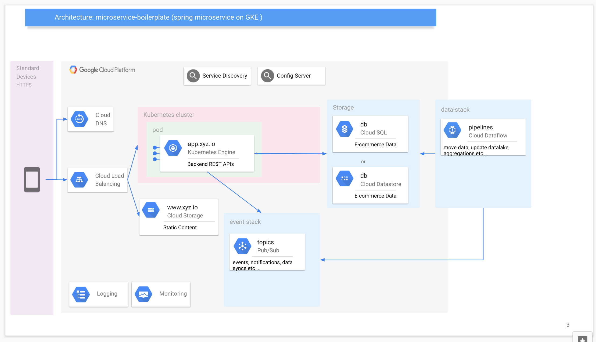

# core-service-h2-app

For microservices, you need a backbone. This boilerplate is to practise core microservice concepts like: 
- [ ] naming conventions
- [ ] config-server, 
- [ ] service-discovery

Technology stack
- spring boot 2.2.7, gradle 6.3, jdk 1.8, Lombok 1.18

//project name for template
//     in intellij: core-service-h2-app
//        package name: com.backbone.core
//project name for a real service
//     in intellij: product-service-app
//        package name: com.backbone.core
//        gradle's project name: product-service
//        jar name: build/libs/product-service-0.0.1-SNAPSHOT.jar

## How To Start

**on IDE**, 

1. `git clone https://github.com/tansudasli/spring-gke-boilerplate.git` then `cd spring-gke-boilerplate`
2. to Run the application  
   * `./gradlew bootRun` to start . check localhost:8080 in your browser, or,
   * `./gradlew bootJar` to create jar lib, and `java -jar build/libs/demo-0.0.1-SNAPSHOT.jar`.
3. Then, check `localhost:8080` in your browser or `curl localhost:8080`
   * `curl localhost:8080/dummy` or `curl localhost:8080/dummy/name`
4. to access h2-db. `localhost:8080/h2-console` in your browser. con. string should be `jdbc:h2:mem:product`,

 **on Kubernetes**,
1. Prepare and deploy docker images
   * Edit `gradle.properties` for gcp and docker parameters
   * Run `./gradlew docker` for docker.io  or `./gradlew dockerTag` for gcr.io. Check w/ 
       - `docker images`
       - `docker run -d -p 8080:8080 gcr.io/sandbox-236618/demo:0.0.1-SNAPSHOT` then `curl localhost:8080`
2. Run `./gradlew dockerPush` for docker.io or `./gradlew dockerPushGCP` for gcr.io
3. if you don't have a GKE cluster on GCP!
   * Edit `create-GKE-cluster.sh` then Run `./create-GKE-cluster.sh`
   * Run `./kubernetes.sh` to deploy demo-app
   * to test, run `kubectl get services` and get EXTERNAL-IP then `curl EXTERNAL-IP:8080` to test.

## High Level Architecture - 

a more realistic scenario w/ data pipelines

